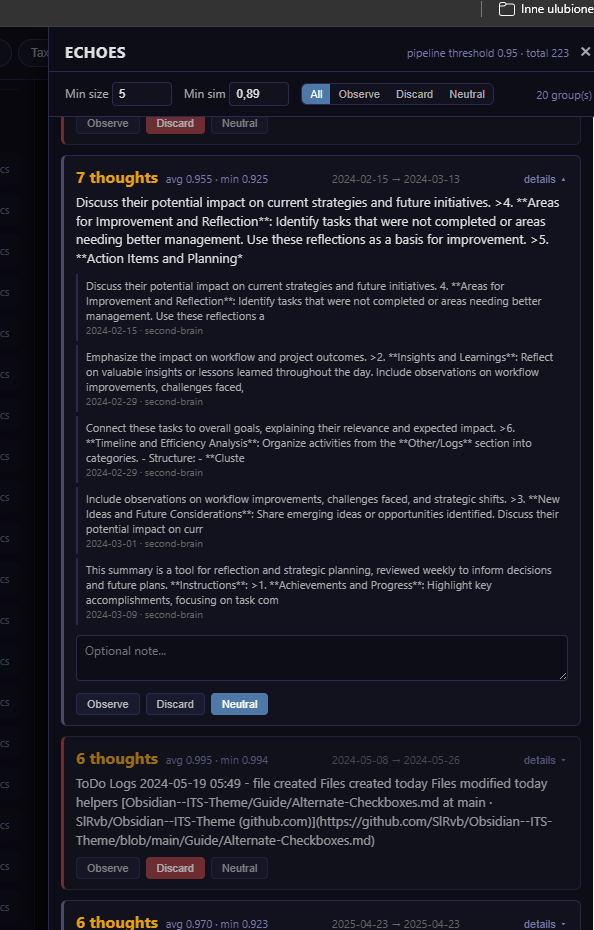
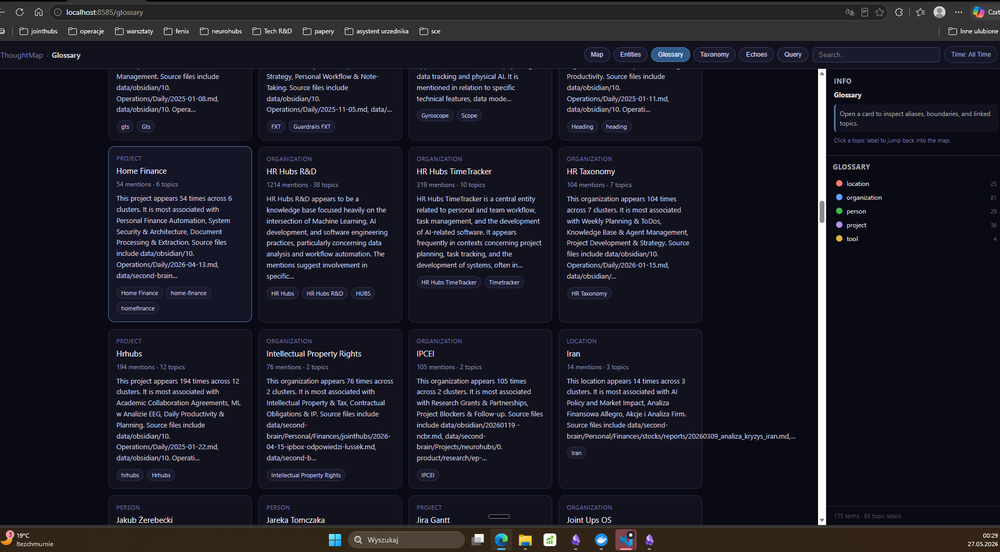
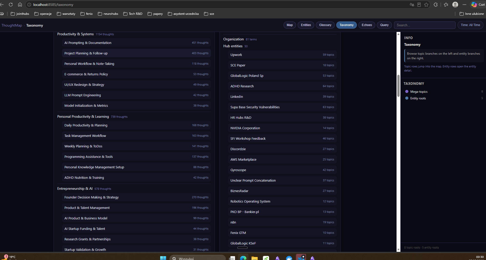

# ThoughtMap

> ← [Back to Projects](../README.md) · [Jointhubs OS](../../../README.md)

Integrated vector storage for personal thought data — daily logs, voice dictation, and working notes — with topic clustering and interactive 2D visualization.

## What It Does

1. **Extracts** raw text from Obsidian daily notes (Logs, Dziennik, ideation sections), root topic notes, jointhubs-os AI reviews, and Wispr Flow dictation transcripts
2. **Chunks** text with sentence-boundary-aware splitting, overlap, and semantic merge
3. **Embeds** chunks locally using `nomic-embed-text:v1.5` via Ollama (768 dims, multilingual en/pl)
4. **Clusters** using UMAP + HDBSCAN to find topic groups (god nodes, bridges)
5. **Visualizes** as an interactive 2D scatter plot with semantic and timeline views
6. **Reports** cluster summaries, topic density, and thought patterns over time

## Quick Start

```bash
# 1. Configure your data paths
cp .env.example .env
# Edit .env with your Obsidian vault path and Wispr Flow directory

# 2. Start everything
docker compose up --build

# 3. Open http://localhost:8585 in your browser
```

The app shows a loading page while the pipeline runs (~1-2 min on first start including model download), then automatically redirects to the interactive visualization.

## Walkthrough — How To Read The UI

ThoughtMap is designed to be browsed from the outside in: start with the whole vault as a shape, drill into one cluster, then into a single topic, then verify the model's understanding through three orthogonal lenses (Echoes, Glossary, Taxonomy).

### 1. Map — Mega-Topics (high level)


This is the entry view. Every diamond is an **auto-generated mega-topic** built from your entire knowledge base — Obsidian notes, daily logs, Wispr Flow dictations, and project docs — clustered purely from embedding similarity, not from tags or folders.

- Diamond **size** = number of thoughts assigned to that mega-topic
- **Edges** show inter-cluster similarity (label is the bridging-thought count)
- The legend on the right ranks mega-topics by thought volume

Reading: "AI Workflow & Practice (2354)" and "Productivity & Systems (1154)" dominate everything else — that is what this brain has actually been doing, not what it claims to be doing.

**Double-click a diamond** to drop one level down.

### 2. Map — Topics inside one mega-topic (mid level)


Same canvas, one level deeper. The 32 topics inside *AI Workflow & Practice* are now nodes, sized by thought count and laid out by semantic proximity. The right-side info panel summarizes what the cluster is actually about — in this case practical LLM workflows, prompting strategy, agent design, and documenting the development process.

This is the level where a mega-topic becomes a useful map: you can see that *LLM Agent Workflow & Tools (183)* and *AI Prompt Engineering & Strategy (142)* are the gravitational centers, while *Sim-to-Real Transfer in RL (59)* sits on the outer edge of the same cluster.

**Double-click a topic** to enter a single topic's interior.

### 3. Map — Hot topic of the month (low level + timeline)


Inside a topic you see its **sub-topics**, but now the **timeline filter** (top-right, here set to *This Month*) is doing real work: only sub-topics with at least one thought from the active time window stay solid; everything else dims out.

The single red node — *Rejestr / Krs / Źródło (1 \| d:6.69)* — is the only sub-topic of *LLM Agent Workflow & Tools* that the current month actually touched. That is the **hot topic of the month** for this branch of the brain. Everything else is structural memory, not current activity.

This is how ThoughtMap answers "what am I actually working on right now, inside this domain?" without you having to grep daily notes.

### 4. Echoes — recurring thoughts across time



Echoes are **near-duplicate thought groups**: distinct chunks that say roughly the same thing, grouped by embedding similarity above a configurable threshold (here `min sim = 0.89`, `min size = 5`).

Each group shows how many times the idea recurred, the average and minimum similarity inside the group, and the date range it spans. The example group of 7 thoughts is the same reflection-and-planning template echoing across a month of daily notes.

Use this to spot:
- templates and boilerplate that should be extracted
- ideas you keep re-deriving without ever writing them down properly
- noise you can mark as *Discard* so future runs ignore it

The *Observe / Discard / Neutral* buttons feed curation back into the pipeline.

### 5. Glossary — entities, sanity-checked by eye



The Glossary lists every **entity** ThoughtMap extracted from the corpus — projects, organizations, people, locations, tools — with the number of mentions, the number of topics it appears in, a short auto-generated summary, and its source files.

Glossary exists for one reason: **trust verification**. If the entity cards on this page look right to you at a glance, the extraction pipeline understood your knowledge base. If they look wrong — wrong type, duplicate names, missing aliases — that is a signal the upstream NER/condensation stages need attention.

### 6. Taxonomy — the same check, from the other direction



Taxonomy shows the **topic tree** (left) and the **entity roots** (right) side by side. It is the second verification surface: Glossary asks "are the entities correct?", Taxonomy asks "do the topic groupings and entity reach look correct against each other?"

If a mega-topic should obviously contain a given entity and it doesn't, or if an entity's `topics` count looks inflated, you find it here.

---

Together those six views give you the full loop: **shape of the brain → branch of the brain → live activity in one branch → recurring thoughts → entities → topic/entity consistency check.**

## Privacy & Data

- **ThoughtMap runs locally by default**: embeddings, clustering, condensation, and entity summaries use Ollama on your machine
- **Repo notes stay on disk**: the pipeline reads local markdown, optional local Obsidian Vault files, and optional local Wispr Flow SQLite history
- **Copilot is separate from ThoughtMap**: using GitHub Copilot in VS Code can send context to cloud-hosted model providers, but running the ThoughtMap pipeline alone does not
- **Cloud embeddings are opt-in**: OpenAI and Google providers are available only if you explicitly configure API keys
- **UI network request**: the visualization currently loads `vis-network.js` from a CDN

## Architecture

```
docker compose up
  ├── thoughtmap-ollama     Ollama server (GPU-accelerated, serves nomic-embed-text)
  └── thoughtmap-app        Pipeline + web server at :8585
        │
        ├── Waits for Ollama, pulls model if needed
        ├── Extract → Chunk → Embed → Merge → Store → Cluster
        ├── Generates REPORT.md + thoughtmap.html + JSON artifacts
        └── Serves interactive visualization at /
```

## How It Works

For a deep technical explanation of how ThoughtMap extracts **clusters**, **topics**, and **entities**, see **[Extraction Pipeline Architecture](docs/extraction-pipeline.md)**.

Key stages:

1. **Step 6: Clustering** — UMAP dimensionality reduction (768d → 15d → 2d) + HDBSCAN density clustering to find topic groups
2. **Step 7: Condensation** — LLM summarization of each cluster, inter-cluster edges, super-clustering (mega-topics), and Obsidian topic notes
3. **Step 8: Entity Extraction** — Named entity recognition via spaCy + regex cache + heuristics, deduplication, LLM validation, enrichment with cluster context
4. **Kanban Intake Generation** — post-processing from recent reviews, communication trackers, and resolved entities into `kanban_tasks.json` + `ThoughtMap Intake.md`

The generated intake board is also a lightweight curation surface:
- delete a generated card to suppress that exact tracked thread on future reruns
- rename a generated card to persist the corrected display title on future reruns
- leave the hidden `%%tm:id=...%%` marker in place so ThoughtMap can match your edits back to the generated card

ThoughtMap persists that curation state in `kanban_curation.json` and reuses it during subsequent reruns.
Those overrides feed back into both Kanban generation and entity generation, so corrected names can propagate into `_entity-index.md`, `entities.json`, and the per-entity notes under `thoughtmap-out/entities/`.

All layers share the same embedding space and depend on `config.py` thresholds. The pipeline is deterministic except for Ollama LLM responses.

## Output

Results land in `Second Brain/Operations/thoughtmap-out/`:

| File | Contents |
|------|----------|
| `thoughtmap.html` | Interactive 2D visualization (semantic + timeline views) |
| `REPORT.md` | Cluster summary, god nodes, source/category breakdown |
| `chunks.json` | All chunks with metadata for downstream use |
| `clusters.json` | Cluster definitions with labels and representative texts |
| `kanban_tasks.json` | Generated Kanban candidate cards with columns, priorities, entities, and optional Tavily research queries |
| `kanban_curation.json` | Machine-managed suppressions and title/entity overrides harvested from manual edits in `ThoughtMap Intake.md` |

`thoughtmap.html` is the UI. Once it has been generated, you do not need Docker just to view it again.

ThoughtMap also writes a markdown-backed Obsidian Kanban intake board to:

`Second Brain/Operations/Kanban/ThoughtMap Intake.md`

Treat this board as generated intake for triage, not the manual source of truth for daily execution.
It is still allowed to edit it manually:
- deleting a card suppresses that tracked thread on future reruns
- renaming a card preserves your corrected title and can seed future entity alias matching
- those same renames can also update future generated entity notes and index entries

## Viewing The UI

There are now two ways to open ThoughtMap:

### 1. Full pipeline + UI via Docker

Use this when you want fresh data:

```bash
docker compose up --build
```

Then open `http://localhost:8585`.

### 2. Static UI only

Use this when you only want to view the last generated output:

```bash
pip install -r requirements.txt
python -m thoughtmap static
```

Then open `http://localhost:8585/thoughtmap.html`.

You can also open the generated file directly from disk:

`Second Brain/Operations/thoughtmap-out/thoughtmap.html`

Static mode does not run extraction, embedding, clustering, or Docker. It only serves the already-generated files from the output folder.

## Configuration

All paths in `config.py` support environment variable overrides. Docker Compose sets them via `.env`:

| Variable | Purpose |
|----------|---------|
| `OBSIDIAN_VAULT` | Path to your Obsidian vault root |
| `WISPR_DB_DIR` | Directory containing `flow.sqlite` |
| `OLLAMA_BASE_URL` | Ollama API endpoint (auto-set in Docker) |
| `THOUGHTMAP_PORT` | Web server port (default: 8585) |

## Scheduled Automation

ThoughtMap can run automatically every night via Windows Task Scheduler.

### Install the schedule

Run once as Administrator from the repo root:

```powershell
powershell -ExecutionPolicy Bypass -File ".github\automation\install-schedules.ps1"
```

### Check schedule status

```powershell
Get-ScheduledTask -TaskName "jointhubs-ThoughtMap" | Format-Table TaskName, State
```

### Run manually (outside schedule)

```powershell
Start-ScheduledTask -TaskName "jointhubs-ThoughtMap"
```

### Stop / disable the schedule

```powershell
# Disable (keeps the task, stops it from running)
Disable-ScheduledTask -TaskName "jointhubs-ThoughtMap"

# Re-enable later
Enable-ScheduledTask -TaskName "jointhubs-ThoughtMap"

# Remove entirely
powershell -ExecutionPolicy Bypass -File ".github\automation\uninstall-schedules.ps1"
```

### Logs

Runs are logged to `Second Brain/Operations/automation-logs/thoughtmap-*.log` (last 30 kept).

See [.github/automation/README.md](../../../.github/automation/README.md) for full details including the weekly graphify schedule.

## CLI Mode

Run the pipeline without the web server:

```bash
pip install -r requirements.txt
python -m thoughtmap       # CLI mode
python -m thoughtmap server  # Web server mode
python -m thoughtmap static  # Serve existing UI only
```

## Related

- [[CONTEXT.md]] — project state and decisions
- Output follows the same convention as [graphify-out](../graphify-out/)

---

## Navigation

| Where | What |
|-------|------|
| ← [Projects](../README.md) | All projects |
| ← [Second Brain](../../README.md) | Knowledge layer overview |
| → [Operations](../../Operations/README.md) | Where thoughtmap-out/ lands |
| → [Automation](../../../.github/automation/README.md) | Nightly scheduled runs |
| → [ThoughtMap Skill](../../../.github/skills/thoughtmap/SKILL.md) | Agent knowledge for ThoughtMap |
